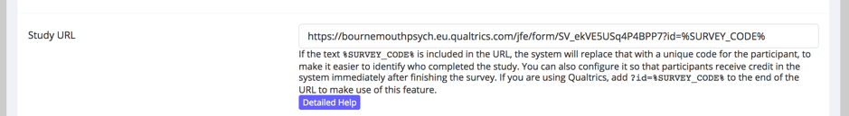
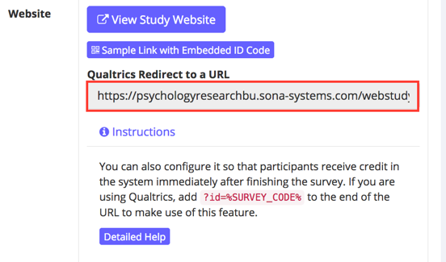
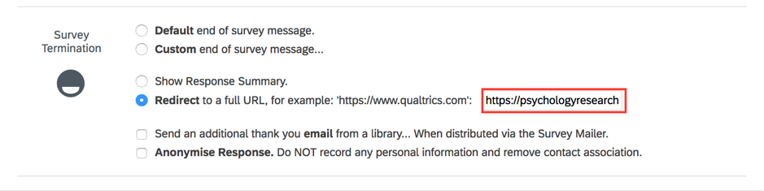

Suggestions for improving this document are welcome, and will help future users (previous users made suggestions that might have have helped you). You can reach me at mgreen@bournemouth.ac.uk.

_matt's todo list_

* [x] _add more screenshots to the later stages_
* [x] _resolve the [where?] placeholder text in the qualtrics to sona section_

```{r setup, include=FALSE}
knitr::opts_chunk$set(echo=TRUE)
```

```{r klippy, echo=FALSE, include=TRUE}
# install.packages("remotes")
# remotes::install_github("rlesur/klippy")
klippy::klippy(position = c('top','left'))
```

Here is an overview of the process.

* Sona generates a random number and uses it as an identifier for the current participant
* It calls this number __SURVEY_CODE__
* It refers to it as __%SURVEY_CODE%__ (notice the added percent signs)
* By passing this number around between sona, qualtrics, and pavlovia, we can use it to identify our participant on each system, because each system will call our participant by the same number. We must refer to this number as __id__ (don't refer to it using anything else because at least one of the systems strictly requires that it be called __id__). We are also going to assume that when SONA generated the number, it was __303__. So, __SURVEY_CODE__ is going to be __303__ in our example. It will be something else for each participant that starts from Sona.

# sona to qualtrics

* First, you need your qualtrics anonymous link.
* This one is made up so it doesn't point to anything, but let's say that your qualtrics anonymous link is

```{r, class.source='klippy', eval=FALSE}
https://bournemouthpsych.eu.qualtrics.com/jfe/form/SV_41MABCMAQJ1MDyt
```

* Take your qualtrics anonymous link and add the following bit of text. Notice that our way of referring to __303__ as __id__ makes an appearance in the bit of text, and so does SONA's way of referring to __303__ as __%SURVEY_CODE%__.

```{r, class.source='klippy', eval=FALSE}
?id=%SURVEY_CODE%
```

* So that, for our example, the whole thing reads

```{r, class.source='klippy', eval=FALSE}
https://bournemouthpsych.eu.qualtrics.com/jfe/form/SV_41MABCMAQJ1MDyt?id=%SURVEY_CODE%
```

* Put the whole string in SONA's Online External Study setup in the Study URL like this



* So at this point we have generated an id with value 303 and passed it to qualtrics.

* The next thing is to tell qualtrics that we are going to send it something that will be called id, and that it will have a different value every time we send it.

* To do this we go to Survey Flow in Qualtrics and do set embedded data field. We call the embedded data field __id__. We say that 'Value will be set from Panel or URL' because qualtrics is going to receive the value of __id__ from the URL that we crafted above.


* Now when our example experiment gets to qualtrics, qualtrics will know about a thing called __id__, and it will know that __id__ is equal to __303__.

# qualtrics to pavlovia

* Now we are going to set things up up so that when qualtrics gets to the end, it sends __id__ and its value (303 in our example) to pavlovia.

* We need the pavlovia 'run' URL at this point. Find it by starting at your pavlovia "Experiments" tab and clicking on your experiment name. The 'run' URL is in the top right. In our example, it is

```{r, class.source='klippy', eval=FALSE}
https://run.pavlovia.org/mgreen/cat-dog/html
```


* Take the pavlovia run url and modify the pavlovia run URL by adding the following string to the end of the pavlovia run URL

```{r, class.source='klippy', eval=FALSE}
?participant=${e://Field/id}
```

* so that we get a crafted URL that looks like this

```{r, class.source='klippy', eval=FALSE}
https://run.pavlovia.org/mgreen/cat-dog/html?participant=${e://Field/id}
```

* In qualtrics now, we want Survey Options, Survey Termination, then the 'Redirect to a full URL' field. Here we enter our crafted URL that we created from the pavlovia run url.


* We need to make sure that pavlovia is expecting to be passed a value in the participant field. This is true by default. You might have changed its name from participant though. If you did, change it back to participant.


# Coming out of pavlovia

You can either go straight back to sona, or go back to qualtrics

## pavlovia to sona

*	Redirect from pavlovia: Take the __Qualtrics Redirect to a URL__ from the __Study Information__ page on SONA and edit it by putting
```{js, class.source='klippy', eval=FALSE}
$"
```
at beginning and changing the end from 
```{r, class.source='klippy', eval=FALSE}
${e://Field/id}
```
to 
```{r, class.source='klippy', eval=FALSE}
"+expInfo['participant']
```

*	So, if your __Qualtrics Redirect to a URL__ URL starts off as
```{r, class.source='klippy', eval=FALSE}
https://psychologyresearchbu.sona-systems.com/webstudy_credit.aspx?experiment_id=956&credit_token=c267aa1ac1024e27a8f8ac8ea13112a5&survey_code=${e://Field/id}
```
then it would become the following, which is what should go in __completed url__ in psychopy.
```{r, class.source='klippy', eval=FALSE}
$"https://psychologyresearchbu.sona-systems.com/webstudy_credit.aspx?experiment_id=956&credit_token=c267aa1ac1024e27a8f8ac8ea13112a5&survey_code="+expInfo['participant']
```

## pavlovia to qualtrics

To pass the participant id (303) from PsychoPy to Qualtrics you will need an __Embedded data field__ in your receiving Qualtrics survey, and it has to be called __id__. In Survey Flow click on the 'Add a New Element Here' link and name it 'id'.

In PsychoPy you will need to put the Anonymous Link for your Qualtrics survey into the __Completed URL__ field adding 

```{r, class.source='klippy', eval=FALSE}
$"
```

at the beginning, and 

```{r, class.source='klippy', eval=FALSE}
?id="+expInfo['participant']
```

at the end. 
 
So, in psychopy, the __completed url__ field should look like this:

```{r, class.source='klippy', eval=FALSE}
$"https://bournemouthpsych.eu.qualtrics.com/jfe/form/SV_3aBcJuzTHwx8abC?id="+expInfo['participant']
```

# qualtrics to sona

Copy the URL in the field called __Qualtrics Redirect to a URL__ from the __Study Information__ page on SONA ...



* Remember to add

```{r, class.source='klippy', eval=FALSE}
?id=%SURVEY_CODE%
```

to the end of the __Qualtrics Redirect to a URL__ if you want SONA to automatically award credit, then, ...

..., find the field __Redirect to a full URL__ in __Survey Termination__ in Qualtrics, ...



..., take the URL that you copied from SONA and paste it in the __Redirect to a full URL__ field. Now when qualtrics gets to the end, it looks at __Survey Termiation__ to see what you want it to do, and sees that you want it to return to Sona, where Sona is ready and waiting to receive __id__ and its value, which are coded into the URL. If you remembered to add ?id=%SURVEY_CODE% then SONA will award credit - if not, then you will have to manually award credit [untested]

# Testing it all

If the whole loop has been set up then you can use the Sample Link with Embedded id code button on the Study Information page on SONA. This means you can test it all before the slots go on the market for sona credit.
