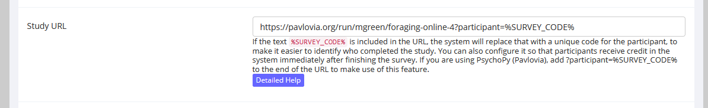
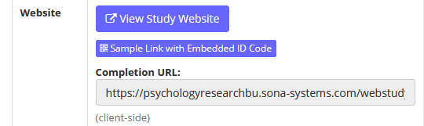
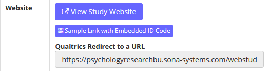
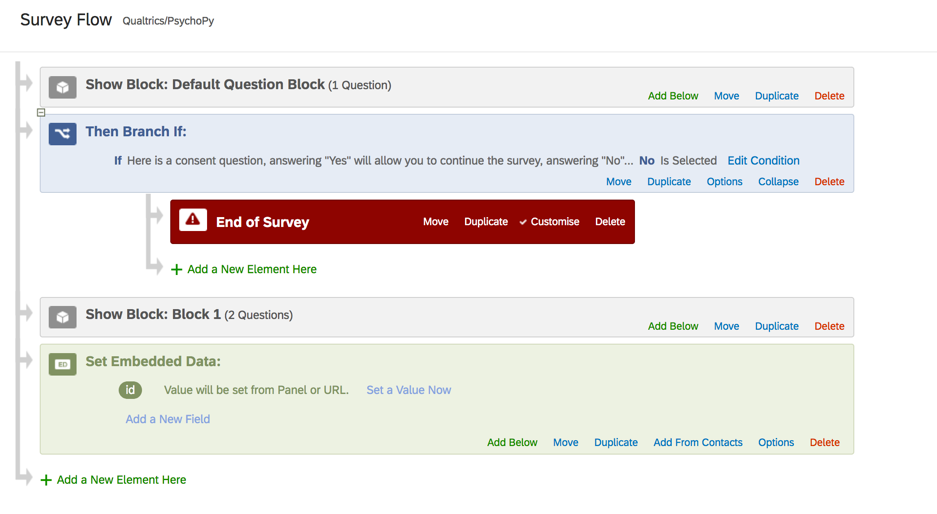
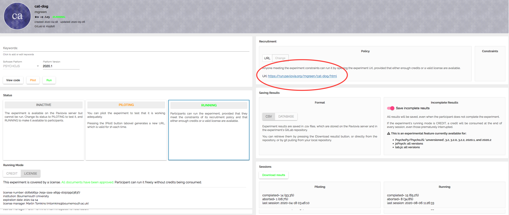
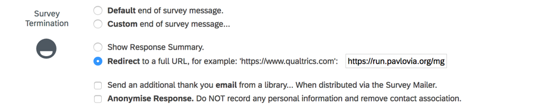
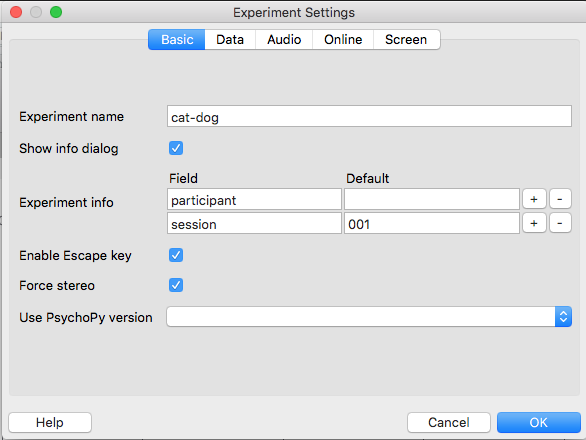
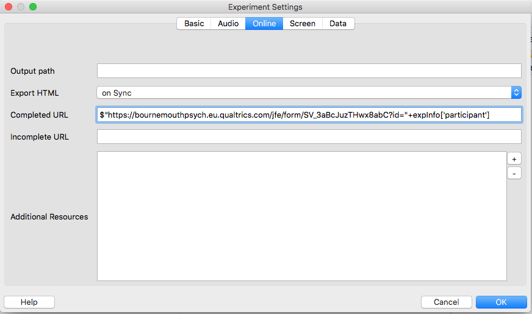
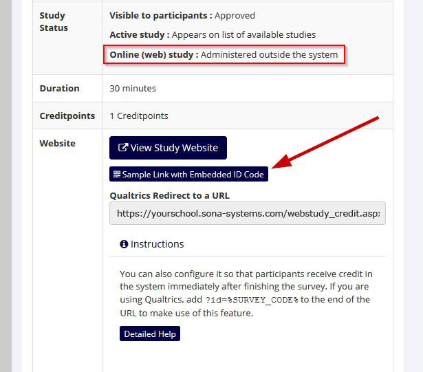
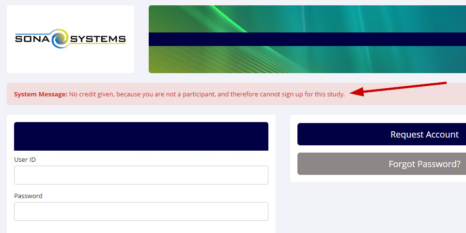

<style type="text/css">
.main-container {
  max-width: 1600px;
  margin-left: auto;
  margin-right: auto;
}
</style>

<!-- * [x] _add more screenshots to the later stages_ -->
<!-- * [x] _resolve the [where?] placeholder text in the Qualtrics to SONA section_ -->

```{r setup, include=FALSE}
knitr::opts_chunk$set(echo=TRUE)
```

```{r klippy, echo=FALSE, include=TRUE}
# install.packages("remotes")
# remotes::install_github("rlesur/klippy")
klippy::klippy(position = c('top','left'))
```

Here is an overview of the process.

* SONA generates a random number and uses it as an identifier for the current participant
* It calls this number __SURVEY_CODE__
* It refers to it as __%SURVEY_CODE%__ (notice the added percent signs)
* By passing this number around between SONA, Qualtrics, and pavlovia, we can use it to identify our participant on each system, because each system will call our participant by the same number. We must refer to this number as __id__ (don't refer to it using anything else because at least one of the systems strictly requires that it be called __id__). We are also going to assume that when SONA generated the number, it was __303__. So, __SURVEY_CODE__ is going to be __303__ in our example. It will be something else for each participant that starts from SONA.

# Setting up SONA: where to find the 'Study URL'

* SONA has changed the way they implement the __Qualtrics anonymous link__. They have put new (more recent than about Feb 2021) instructions at https://www.sona-systems.com/help/qualtrics.aspx but here is a digest of that information.

* Where we refer to 'Study URL', that is accessible from 'Change Study Information' option from the 'Study Menu' dropdown.

# Coming out of SONA

* What to do depends on where you are going: to pavlovia or to Qualtrics

## SONA to pavlovia

* detailed info at https://www.sona-systems.com/help/psychopy.aspx?p_experiment_id=2286&p_credit_token=6ff9d985812847a294dddb152589ff1c

* On your SONA Systems site, change the Study URL so it includes 
```{r, class.source='klippy', eval=FALSE}
?participant=%SURVEY_CODE%
```
at the end of the URL. So if the pavlovia run URL is:
```{r, class.source='klippy', eval=FALSE}
https://pavlovia.org/run/myname/mystudy
```
then change it to:
```{r, class.source='klippy', eval=FALSE}
https://pavlovia.org/run/myname/mystudy?participant=%SURVEY_CODE%
```
So that it looks like this:



Now, the Study Information on your SONA Systems site now displays a __Completion URL__ that looks like this:



The whole Completion URL (that is cut off in the website above) looks like this

```{r, class.source='klippy', eval=FALSE}
https://psychologyresearchbu.sona-systems.com/webstudy_credit.aspx?experiment_id=1234&credit_token=6ff9d985812847a294dddb152589ff1c&survey_code=XXXX
```

In PsychoPy, go to Experiment Settings and for the Completed URL field, copy the Completion URL from SONA but you will need to modify it slightly, by adding 

```{r, class.source='klippy', eval=FALSE}
$"
```

to the front of that URL, removing the `XXXX` and adding `"+expInfo['participant']` to the end of it. So if the Completion URL from SONA is:

```{r, class.source='klippy', eval=FALSE}
https://psychologyresearchbu.sona-systems.com/webstudy_credit.aspx?experiment_id=1234&credit_token=6ff9d985812847a294dddb152589ff1c&survey_code=XXXX
```

change it to:

```{r, class.source='klippy', eval=FALSE}
$"https://psychologyresearchbu.sona-systems.com/webstudy_credit.aspx?experiment_id=123&credit_token=6ff9d985812847a294dddb152589ff1c&survey_code="+expInfo['participant']
```

## SONA to Qualtrics

* On your SONA Systems site, change the Study URL so it includes 

```{r, class.source='klippy', eval=FALSE}
?id=%SURVEY_CODE%
```

at the end of the Study URL. So if the Qualtrics URL (Anonymous Survey Link) is:

```{r, class.source='klippy', eval=FALSE}
https://bournemouthpsych.eu.qualtrics.com/jfe/form/SV_41MABCMAQJ1MDyt
```

then change it to:

```{r, class.source='klippy', eval=FALSE}
https://bournemouthpsych.eu.qualtrics.com/jfe/form/SV_41MABCMAQJ1MDyt?id=%SURVEY_CODE%
```

__(Note: "id" must be in lower-case)__

so that it looks like this:


Now, the Study Information on your SONA Systems site displays a __Qualtrics Redirect to a URL__



The full __Qualtrics Redirect to a URL__ is cut off in the website view: it looks like this:

```{r, class.source='klippy', eval=FALSE}
https://psychologyresearchbu.sona-systems.com/webstudy_credit.aspx?experiment_id=2292&credit_token=45afb612c6864e6da9236d2a16142bf0&survey_code=${e://Field/id}
```

* The next thing is to tell Qualtrics that we are going to send it something that will be called id, and that it will have a different value every time we send it.

* To do this we go to Survey Flow in Qualtrics and do set embedded data field. We call the embedded data field __id__. We say that 'Value will be set from Panel or URL' because Qualtrics is going to receive the value of __id__ from the URL that we crafted above.



* Now when our example experiment gets to Qualtrics, Qualtrics will know about a thing called __id__, and it will know that __id__ is equal to __303__.

# Coming out of Qualtrics

## Qualtrics to SONA

Copy the URL in the field called __Qualtrics Redirect to a URL__ from the __Study Information__ page on SONA ...


It is cut off in that screenshot: paste it into a text editor and you'll see that it looks like this:

```{r, class.source='klippy', eval=FALSE}
https://psychologyresearchbu.sona-systems.com/webstudy_credit.aspx?experiment_id=2292&credit_token=45afb612c6864e6da9236d2a16142bf0&survey_code=${e://Field/id}
```

Find the field __Redirect to a full URL__ in __Survey Termination__ in Qualtrics, ...


..., take the URL that you copied from SONA and paste it in the __Redirect to a full URL__ field. Now when Qualtrics gets to the end, it looks at __Survey Termiation__ to see what you want it to do, and sees that you want it to return to SONA, where SONA is ready and waiting to receive __id__ and its value, which are coded into the URL. If you remembered to add `?id=%SURVEY_CODE%` in the __Study URL__ on SONA then SONA will award credit - if not, then you will have to manually award credit [untested]

## Qualtrics to pavlovia

* We assume that you are going to pavlovia next.

* Now we are going to set things up up so that when Qualtrics gets to the end, it sends __id__ and its value (303 in our example) to pavlovia.

* We need the pavlovia 'run' URL at this point. Find it by starting at your pavlovia "Experiments" tab and clicking on your experiment name. The 'run' URL is in the top right. In our example, it is

```{r, class.source='klippy', eval=FALSE}
https://run.pavlovia.org/mgreen/cat-dog/html
```



* Take the pavlovia run url and modify the pavlovia run URL by adding the following string to the end of the pavlovia run URL

```{r, class.source='klippy', eval=FALSE}
?participant=${e://Field/id}
```

* so that we get a crafted URL that looks like this

```{r, class.source='klippy', eval=FALSE}
https://run.pavlovia.org/mgreen/cat-dog/html?participant=${e://Field/id}
```

* In Qualtrics now, we want Survey Options, Survey Termination, then the 'Redirect to a full URL' field. Here we enter our crafted URL that we created from the pavlovia run url.



* We need to make sure that pavlovia is expecting to be passed a value in the participant field. This is true by default. You might have changed its name from participant though. If you did, change it back to participant.



# Coming out of pavlovia

You can either go straight back to SONA, or go back to Qualtrics

## pavlovia to SONA

This section applies if you are going from pavlovia to SONA and if you went from SONA to Qualtrics. If you went from SONA to PsychoPy directly then you are already set and you can ignore this section.

*	Redirect from pavlovia: Take the __Qualtrics Redirect to a URL__ from the __Study Information__ page on SONA and edit it by putting
```{js, class.source='klippy', eval=FALSE}
$"
```
at beginning and changing the end from 
```{r, class.source='klippy', eval=FALSE}
${e://Field/id}
```
to 
```{r, class.source='klippy', eval=FALSE}
"+expInfo['participant']
```

*	So, if your __Qualtrics Redirect to a URL__ URL starts off as
```{r, class.source='klippy', eval=FALSE}
https://psychologyresearchbu.sona-systems.com/webstudy_credit.aspx?experiment_id=956&credit_token=c267aa1ac1024e27a8f8ac8ea13112a5&survey_code=${e://Field/id}
```
then it would become the following, which is what should go in __completed url__ in PsychoPy.
```{r, class.source='klippy', eval=FALSE}
$"https://psychologyresearchbu.sona-systems.com/webstudy_credit.aspx?experiment_id=956&credit_token=c267aa1ac1024e27a8f8ac8ea13112a5&survey_code="+expInfo['participant']
```

## pavlovia to Qualtrics

To pass the participant id (303) from PsychoPy to Qualtrics you will need an __Embedded data field__ in your receiving Qualtrics survey, and it has to be called __id__. In Survey Flow click on the 'Add a New Element Here' link and name it 'id'.

In PsychoPy you will need to put the Anonymous Link for your Qualtrics survey into the __Completed URL__ field adding 

```{r, class.source='klippy', eval=FALSE}
$"
```

at the beginning, and 

```{r, class.source='klippy', eval=FALSE}
?id="+expInfo['participant']
```

at the end. 
 
So, in PsychoPy, the __completed url__ field should look like this:

```{r, class.source='klippy', eval=FALSE}
$"https://bournemouthpsych.eu.qualtrics.com/jfe/form/SV_3aBcJuzTHwx8abC?id="+expInfo['participant']
```

The next screenshot shows where you need to put that value. __It must be in the graphical user interface shown here__: editing the .psyexp file using a text editor will fail (because doing it that way skips the step where the PsychoPy app compiles the XML in the .psyexp file into the javascript that will eventually run on the participant's computer).



# Testing it all

If the whole loop has been set up then you can use the __Sample Link with Embedded ID Code__ button on the Study Information page on SONA. This means you can test it all before the slots go on the market for SONA credit.



When you are redirected to the SONA site, if you see the message: 'No credit given, because you are not a participant, and therefore cannot sign up for this study' __then it worked!__ That indicates the system received a code indicating who you are, and it realizes you are not a participant and can’t sign up for the study.



# Example links from a working chain

* These are for the full journey: SONA to Qualtrics 1 to pavlovia to Qualtrics 2 to SONA

SONA to Qualtrics1 

```{r, class.source='klippy', eval=FALSE}
https://bournemouthpsych.eu.qualtrics.com/jfe/form/SV_6Wor2HlNqfJ8Lzw?id=%SURVEY_CODE% 
```

Qualtrics1 to pavlovia 

```{r, class.source='klippy', eval=FALSE}
https://pavlovia.org/run/mgreen/testchain?participant=${e://Field/id}
```

pavlovia to Qualtrics 2 

```{r, class.source='klippy', eval=FALSE}
$"https://bournemouthpsych.eu.qualtrics.com/jfe/form/SV_2i6zAY4iNiykbhY?id="+expInfo['participant'] 
```

Qualtrics 2 to SONA 

```{r, class.source='klippy', eval=FALSE}
https://psychologyresearchbu.sona-systems.com/webstudy_credit.aspx?experiment_id=2292&credit_token=45afb612c6864e6da9236d2a16142bf0&survey_code=${e://Field/id}
```


 

 

 